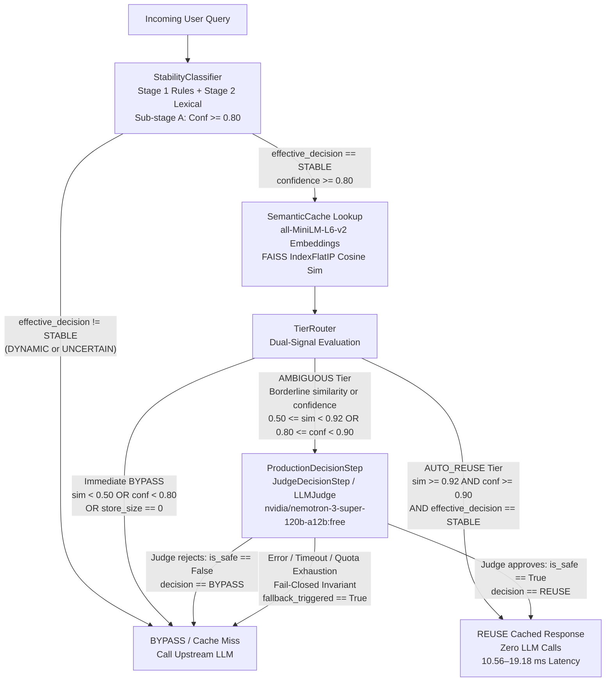

# System Architecture and Design Document

> **Authoritative Fact Source:** Every metric, threshold, latency measurement, and sample count in this document originates from [`docs/FACTS.md`](file:///c:/Users/parid/Downloads/Agentic%20AI/adaptive-agentic-semantic-cache/docs/FACTS.md). Stale reports (such as the legacy status report or master PDF) must not be referenced.

---

## 1. Problem: Why Naive Semantic Caching is Unsafe

Semantic caching aims to mitigate the high latency and cost of Large Language Model (LLM) queries by embedding incoming user prompts and returning previously computed responses when the cosine similarity between the incoming prompt and a cached prompt exceeds a threshold $\theta$.

In naive implementations, similarity-only semantic caching relies entirely on this single scalar metric. In agentic and enterprise environments, this approach produces **false-positive reuse ($IRR_{\text{cache}}$)**—admitting cached answers that are syntactically or semantically similar in embedding space but factually invalid, stale, or contradictory.

Naive semantic caching fails due to fundamental hazards:

1. **Temporal Volatility:** Queries concerning real-time information (e.g., weather conditions, stock quotations, system operational metrics) may achieve near-perfect (or exact 1.00) cosine similarity with previous queries. Reusing cached answers serves stale or invalid data to autonomous agents, risking silent cascading failures.
2. **Semantic Inversion and Traps:** Embeddings (such as sentence-transformers) capture lexical and thematic overlap, but frequently fail to distinguish polarity inversions or parameter reversals. For example, contrasting units (`radians -> degrees` versus `degrees -> radians`) can produce high cosine similarities exceeding the AUTO_REUSE floor (0.92, [`FACTS.md` row C-06](file:///c:/Users/parid/Downloads/Agentic%20AI/adaptive-agentic-semantic-cache/docs/FACTS.md#L34)) despite requiring completely opposite responses.
3. **Failure of Global Fixed Thresholds:** In our Phase 2 sweep across the 120-pair reuse benchmark ([`FACTS.md` row D-01](file:///c:/Users/parid/Downloads/Agentic%20AI/adaptive-agentic-semantic-cache/docs/FACTS.md#L52)), every fixed threshold producing any cache hits violated the pre-stated safety criterion of $IRR_{\text{cache}} < 10\%$ ([`FACTS.md` row P2-02](file:///c:/Users/parid/Downloads/Agentic%20AI/adaptive-agentic-semantic-cache/docs/FACTS.md#L75)). The lowest hazard rate observed was **20.83%** (5 false positives out of 24 hits; [`FACTS.md` row P2-01](file:///c:/Users/parid/Downloads/Agentic%20AI/adaptive-agentic-semantic-cache/docs/FACTS.md#L74)) at threshold 0.85 ([`FACTS.md` row P2-04](file:///c:/Users/parid/Downloads/Agentic%20AI/adaptive-agentic-semantic-cache/docs/FACTS.md#L77)). Fixed thresholds cannot separate safe paraphrases from hazardous semantic traps.

In an agentic loop, false-positive reuse is far more dangerous than a cache miss: a miss incurs latency, but a false hit injects false premises into an autonomous execution chain.

---

## 2. Architecture

The system implements a gated pipeline designed to gate and inspect query reusability before any cached content is served.

### 2.1 Pipeline Flow Diagram

### 2.2 Tier Rules as Coded (`src/decision/tier_router.py`)

Routing does **not** evaluate similarity in isolation. As coded in [`src/decision/tier_router.py`](file:///c:/Users/parid/Downloads/Agentic%20AI/adaptive-agentic-semantic-cache/src/decision/tier_router.py#L210-L215) and [`src/decision/tier_router.py`](file:///c:/Users/parid/Downloads/Agentic%20AI/adaptive-agentic-semantic-cache/src/decision/tier_router.py#L269-L317), the routing logic combines `CacheLookupResult.similarity_score` with `StabilityResult.confidence` and `StabilityResult.effective_decision`:

1. **Immediate BYPASS Conditions:**
   - Pre-cache stability decision is volatile: `stability.effective_decision != StabilityLabel.STABLE`
   - Empty cache store or missing vector: `cache.store_size == 0` or `cache.similarity_score == float("-inf")`
   - Similarity score below bypass ceiling: `cache.similarity_score < bypass_sim_ceiling` (**0.50**, [`FACTS.md` row C-08](file:///c:/Users/parid/Downloads/Agentic%20AI/adaptive-agentic-semantic-cache/docs/FACTS.md#L36))
   - Stability confidence below bypass ceiling: `stability.confidence < bypass_conf_ceiling` (**0.80**, [`FACTS.md` row C-09](file:///c:/Users/parid/Downloads/Agentic%20AI/adaptive-agentic-semantic-cache/docs/FACTS.md#L37))
2. **AUTO_REUSE Conditions (All must be satisfied simultaneously):**
   - High similarity: `cache.similarity_score >= auto_reuse_sim_floor` (**0.92**, [`FACTS.md` row C-06](file:///c:/Users/parid/Downloads/Agentic%20AI/adaptive-agentic-semantic-cache/docs/FACTS.md#L34))
   - High stability confidence: `stability.confidence >= auto_reuse_conf_floor` (**0.90**, [`FACTS.md` row C-07](file:///c:/Users/parid/Downloads/Agentic%20AI/adaptive-agentic-semantic-cache/docs/FACTS.md#L35))
   - Proven stability: `stability.effective_decision == StabilityLabel.STABLE`
3. **AMBIGUOUS Tier:**
   - All queries passing the BYPASS ceilings but failing either the similarity floor (0.92) or the confidence floor (0.90).
   - Routed directly to `ProductionDecisionStep` ([`src/decision/decision_step.py`](file:///c:/Users/parid/Downloads/Agentic%20AI/adaptive-agentic-semantic-cache/src/decision/decision_step.py#L529)), which invokes `LLMJudge` using `nvidia/nemotron-3-super-120b-a12b:free` via OpenRouter ([`FACTS.md` row C-14](file:///c:/Users/parid/Downloads/Agentic%20AI/adaptive-agentic-semantic-cache/docs/FACTS.md#L42)).
4. **Fail-Closed Production Invariant:**
   - On any network timeout, model hallucination, JSON parsing failure, missing API key, or quota exhaustion, `judge_call.py` returns `decision=BYPASS`, `is_safe=False`, `confidence=0.0`, and `fallback_triggered=True` ([`FACTS.md` row C-16](file:///c:/Users/parid/Downloads/Agentic%20AI/adaptive-agentic-semantic-cache/docs/FACTS.md#L44)). The system never fails open.

---

## 3. Decisions and Evidence Per Phase

| Phase | Core Decision | Hypothesized Path | Empirical Evidence & Ground-Truth Outcome |
| :---: | :--- | :--- | :--- |
| **Phase 1** | **Classifier Gate** | Volatile queries can be filtered before cache lookup using a lightweight lexical/rule classifier. | **Adopted.** Evaluated on pristine final test set (N=60, [`FACTS.md` row D-04](file:///c:/Users/parid/Downloads/Agentic%20AI/adaptive-agentic-semantic-cache/docs/FACTS.md#L55)) yielding **91.67% accuracy** (55/60 correct; [`FACTS.md` row P1-01](file:///c:/Users/parid/Downloads/Agentic%20AI/adaptive-agentic-semantic-cache/docs/FACTS.md#L68)) and **0 dangerous errors** (FP=0 on 23 dynamic queries; [`FACTS.md` row P1-02](file:///c:/Users/parid/Downloads/Agentic%20AI/adaptive-agentic-semantic-cache/docs/FACTS.md#L69)), with a 13.51% conservative error rate (5 FN; [`FACTS.md` row P1-05](file:///c:/Users/parid/Downloads/Agentic%20AI/adaptive-agentic-semantic-cache/docs/FACTS.md#L72)). Confirmed on held-out challenge set (N=60, [`FACTS.md` row D-03](file:///c:/Users/parid/Downloads/Agentic%20AI/adaptive-agentic-semantic-cache/docs/FACTS.md#L54)) with **91.67% accuracy** ([`FACTS.md` row P1-03](file:///c:/Users/parid/Downloads/Agentic%20AI/adaptive-agentic-semantic-cache/docs/FACTS.md#L70)) and **0 dangerous errors** ([`FACTS.md` row P1-04](file:///c:/Users/parid/Downloads/Agentic%20AI/adaptive-agentic-semantic-cache/docs/FACTS.md#L71)). |
| **Phase 2** | **Fixed Threshold Sweep** | A tuned scalar threshold on cosine similarity could satisfy the safety ceiling ($IRR_{\text{cache}} < 10\%$). | **Rejected.** Tested across 120 query pairs ([`FACTS.md` row D-01](file:///c:/Users/parid/Downloads/Agentic%20AI/adaptive-agentic-semantic-cache/docs/FACTS.md#L52), [`FACTS.md` row P2-06](file:///c:/Users/parid/Downloads/Agentic%20AI/adaptive-agentic-semantic-cache/docs/FACTS.md#L79)). Fixed thresholds failed completely: across all thresholds where hits > 0, $IRR_{\text{cache}} \ge 20.83\%$ ([`FACTS.md` row P2-03](file:///c:/Users/parid/Downloads/Agentic%20AI/adaptive-agentic-semantic-cache/docs/FACTS.md#L76)). The best fixed threshold was 0.85 ([`FACTS.md` row P2-04](file:///c:/Users/parid/Downloads/Agentic%20AI/adaptive-agentic-semantic-cache/docs/FACTS.md#L77)) with **20.83%** hazard rate (5 FP / 24 hits; [`FACTS.md` row P2-01](file:///c:/Users/parid/Downloads/Agentic%20AI/adaptive-agentic-semantic-cache/docs/FACTS.md#L74)), failing the <10% ceiling ([`FACTS.md` row P2-02](file:///c:/Users/parid/Downloads/Agentic%20AI/adaptive-agentic-semantic-cache/docs/FACTS.md#L75)). Vector lookup latency averaged 13.9–14.9 ms ([`FACTS.md` row P2-05](file:///c:/Users/parid/Downloads/Agentic%20AI/adaptive-agentic-semantic-cache/docs/FACTS.md#L78)). |
| **Phase 3** | **LLM Judge for Ambiguous Tier** | Linear combination of signals could resolve borderline queries, or an LLM judge is required. | **Adopted LLM Judge; Rejected Non-LLM Combination.** Non-LLM linear combination produced an unacceptable $IRR_{\text{cache}}$ of **52.17%** overall (12 FP / 23 hits; [`FACTS.md` row P3-01](file:///c:/Users/parid/Downloads/Agentic%20AI/adaptive-agentic-semantic-cache/docs/FACTS.md#L87)) and **57.1%** in the ambiguous band ([`FACTS.md` row P3-02](file:///c:/Users/parid/Downloads/Agentic%20AI/adaptive-agentic-semantic-cache/docs/FACTS.md#L88)). In contrast, the AUTO_REUSE tier had **0.00%** $IRR_{\text{cache}}$ (TP=2, FP=0; [`FACTS.md` row P3-03](file:///c:/Users/parid/Downloads/Agentic%20AI/adaptive-agentic-semantic-cache/docs/FACTS.md#L89)). An initial Gemini judge attempt stalled at 17/32 pairs due to daily quota exhaustion ([`FACTS.md` row C-15](file:///c:/Users/parid/Downloads/Agentic%20AI/adaptive-agentic-semantic-cache/docs/FACTS.md#L43), [`FACTS.md` row P3-04](file:///c:/Users/parid/Downloads/Agentic%20AI/adaptive-agentic-semantic-cache/docs/FACTS.md#L90), [`FACTS.md` row P3-05](file:///c:/Users/parid/Downloads/Agentic%20AI/adaptive-agentic-semantic-cache/docs/FACTS.md#L91)). The OpenRouter Nemotron judge evaluated all 32 ambiguous pairs, achieving **8.33%** $IRR_{\text{cache}}$ (1 FP / 12 hits; [`FACTS.md` row P3-06](file:///c:/Users/parid/Downloads/Agentic%20AI/adaptive-agentic-semantic-cache/docs/FACTS.md#L92)), 10.00% ARR (12 hits / 120 pairs; [`FACTS.md` row P3-07](file:///c:/Users/parid/Downloads/Agentic%20AI/adaptive-agentic-semantic-cache/docs/FACTS.md#L93)), and 95% Clopper-Pearson CI [0.21%, 38.48%] ([`FACTS.md` row P3-06](file:///c:/Users/parid/Downloads/Agentic%20AI/adaptive-agentic-semantic-cache/docs/FACTS.md#L92)). Tier distribution: AUTO_REUSE=2 (1.7%), AMBIGUOUS=32 (26.7%), BYPASS=86 (71.7%) ([`FACTS.md` row P3-08](file:///c:/Users/parid/Downloads/Agentic%20AI/adaptive-agentic-semantic-cache/docs/FACTS.md#L94)). |
| **Phase 4** | **Per-Category Adaptive Thresholds** | Statistical calibration on domain feedback could shift operating thresholds away from the 0.85 fallback. | **Evaluated and Not Adopted.** A total of 108 targeted synthetic pairs were labeled by genuine judge calls across 7 domains ([`FACTS.md` row D-06](file:///c:/Users/parid/Downloads/Agentic%20AI/adaptive-agentic-semantic-cache/docs/FACTS.md#L57), [`FACTS.md` row P4-02](file:///c:/Users/parid/Downloads/Agentic%20AI/adaptive-agentic-semantic-cache/docs/FACTS.md#L103)). Exactly **0 of 7 categories** moved off the 0.85 fallback ([`FACTS.md` row P4-01](file:///c:/Users/parid/Downloads/Agentic%20AI/adaptive-agentic-semantic-cache/docs/FACTS.md#L102), [`FACTS.md` row P4-03](file:///c:/Users/parid/Downloads/Agentic%20AI/adaptive-agentic-semantic-cache/docs/FACTS.md#L104)). Enforcing the $IRR_{\text{cache}} \le 10\%$ safety ceiling at 95% confidence requires $n \ge 36$ hits with zero false positives ([`FACTS.md` row P4-04](file:///c:/Users/parid/Downloads/Agentic%20AI/adaptive-agentic-semantic-cache/docs/FACTS.md#L105)). Because finite domain samples cannot clear this bar without admitting unsafe semantic traps, all 7 categories legitimately remained on the 0.85 fallback ([`FACTS.md` row P4-01](file:///c:/Users/parid/Downloads/Agentic%20AI/adaptive-agentic-semantic-cache/docs/FACTS.md#L102), [`FACTS.md` row KL-11](file:///c:/Users/parid/Downloads/Agentic%20AI/adaptive-agentic-semantic-cache/docs/FACTS.md#L221)). |

---

## 4. "What is Adaptive Here"

The term "adaptive" must be stated directly and accurately without overstatement:

1. **The LLM Judge Reasons Per Query:**
   The primary adaptive mechanism operating in production is the **prompt-driven LLM Judge** (`JudgeDecisionStep` / `LLMJudge`). For all traffic routed to the AMBIGUOUS tier, the judge dynamically inspects the full semantic context, prompt constraints, intent nuances, and domain properties of the query pair. It does not apply a static geometric cutoff; it reasons over semantic equivalence on a case-by-case basis.
2. **The Per-Category Threshold System Built, Tested, But Never Fired:**
   The mathematical mechanism for per-category threshold fitting (`AdaptiveThresholdEngine`) is fully implemented in [`src/decision/adaptive_threshold_engine.py`](file:///c:/Users/parid/Downloads/Agentic%20AI/adaptive-agentic-semantic-cache/src/decision/adaptive_threshold_engine.py#L78-L82) with sample gates (`MINIMUM_CATEGORY_N=20`, `MINIMUM_MINORITY_CLASS_N=10`; [`FACTS.md` rows C-10, C-11](file:///c:/Users/parid/Downloads/Agentic%20AI/adaptive-agentic-semantic-cache/docs/FACTS.md#L38-L39)), fallback threshold 0.85 ([`FACTS.md` row C-12](file:///c:/Users/parid/Downloads/Agentic%20AI/adaptive-agentic-semantic-cache/docs/FACTS.md#L40)), and safety ceiling $IRR_{\text{cache}} \le 0.10$ ([`FACTS.md` row C-13](file:///c:/Users/parid/Downloads/Agentic%20AI/adaptive-agentic-semantic-cache/docs/FACTS.md#L41)).
   
   However, **this mechanism has never fired in production**: all 7 categories stayed on the 0.85 global fallback ([`FACTS.md` row P4-01](file:///c:/Users/parid/Downloads/Agentic%20AI/adaptive-agentic-semantic-cache/docs/FACTS.md#L102), [`FACTS.md` row KL-11](file:///c:/Users/parid/Downloads/Agentic%20AI/adaptive-agentic-semantic-cache/docs/FACTS.md#L221)).
3. **Why It Never Fired ([`FACTS.md` row KL-02](file:///c:/Users/parid/Downloads/Agentic%20AI/adaptive-agentic-semantic-cache/docs/FACTS.md#L212), [`FACTS.md` row P4-04](file:///c:/Users/parid/Downloads/Agentic%20AI/adaptive-agentic-semantic-cache/docs/FACTS.md#L105)):**
   Under Clopper-Pearson exact binomial confidence intervals at 95% confidence, proving an upper bound $IRR_{\text{cache}} \le 10\%$ when zero false positives are observed ($k=0$) requires at least **$n \ge 36$ admitted hits** ([`FACTS.md` row P4-04](file:///c:/Users/parid/Downloads/Agentic%20AI/adaptive-agentic-semantic-cache/docs/FACTS.md#L105)).
   
   In calibration across the 120 historical benchmark pairs ([`FACTS.md` row D-01](file:///c:/Users/parid/Downloads/Agentic%20AI/adaptive-agentic-semantic-cache/docs/FACTS.md#L52)) and 108 synthetic pairs ([`FACTS.md` row D-06](file:///c:/Users/parid/Downloads/Agentic%20AI/adaptive-agentic-semantic-cache/docs/FACTS.md#L57)), no category observed sufficient admitted hits to mathematically clear the 10% safety ceiling ([`FACTS.md` row C-13](file:///c:/Users/parid/Downloads/Agentic%20AI/adaptive-agentic-semantic-cache/docs/FACTS.md#L41)). Lowering the similarity threshold to artificially force hit accumulation admitted semantic traps and prompt inversions, triggering immediate safety violations.
   
   The system adhered strictly to its design invariant: **fail-closed to the safe fallback threshold (0.85) when statistical evidence is insufficient** ([`FACTS.md` row C-12](file:///c:/Users/parid/Downloads/Agentic%20AI/adaptive-agentic-semantic-cache/docs/FACTS.md#L40), [`FACTS.md` row P4-03](file:///c:/Users/parid/Downloads/Agentic%20AI/adaptive-agentic-semantic-cache/docs/FACTS.md#L104)).

---

## 5. Validation Methodology

### 5.1 Dataset Roles Table

All datasets used across the project and their validation roles are formally cataloged in [`docs/FACTS.md` Section 12](file:///c:/Users/parid/Downloads/Agentic%20AI/adaptive-agentic-semantic-cache/docs/FACTS.md#L223-L236):

| Dataset Role | Dataset File | N | Composition / Breakdown | Evaluation Nature | FACTS.md Rows |
| :--- | :--- | :---: | :--- | :--- | :--- |
| **Classifier Train / Dev** | `data/raw/query_stability_benchmark.json` + `data/raw/query_stability_human_credibility.json` | **245** | 160 dev queries + 85 human credibility queries | Same-set development and diagnostic tuning | [`DROLE-01`](file:///c:/Users/parid/Downloads/Agentic%20AI/adaptive-agentic-semantic-cache/docs/FACTS.md#L227), [`D-02`](file:///c:/Users/parid/Downloads/Agentic%20AI/adaptive-agentic-semantic-cache/docs/FACTS.md#L53), [`D-05`](file:///c:/Users/parid/Downloads/Agentic%20AI/adaptive-agentic-semantic-cache/docs/FACTS.md#L56) |
| **Held-Out Challenge** | `data/raw/query_stability_benchmark_heldout.json` | **60** | 31 STABLE, 24 DYNAMIC, 5 CONDITIONALLY_STABLE | Held-out challenge (unseen during prompt/rule tuning) | [`DROLE-02`](file:///c:/Users/parid/Downloads/Agentic%20AI/adaptive-agentic-semantic-cache/docs/FACTS.md#L228), [`D-03`](file:///c:/Users/parid/Downloads/Agentic%20AI/adaptive-agentic-semantic-cache/docs/FACTS.md#L54), [`P1-03`](file:///c:/Users/parid/Downloads/Agentic%20AI/adaptive-agentic-semantic-cache/docs/FACTS.md#L70), [`P1-04`](file:///c:/Users/parid/Downloads/Agentic%20AI/adaptive-agentic-semantic-cache/docs/FACTS.md#L71) |
| **Final Test** | `data/raw/query_stability_benchmark_final_test.json` | **60** | 37 STABLE, 23 DYNAMIC | Clean for tuning; seen once by pytest ([`KL-10`](file:///c:/Users/parid/Downloads/Agentic%20AI/adaptive-agentic-semantic-cache/docs/FACTS.md#L220)) | [`DROLE-03`](file:///c:/Users/parid/Downloads/Agentic%20AI/adaptive-agentic-semantic-cache/docs/FACTS.md#L229), [`D-04`](file:///c:/Users/parid/Downloads/Agentic%20AI/adaptive-agentic-semantic-cache/docs/FACTS.md#L55), [`P1-01`](file:///c:/Users/parid/Downloads/Agentic%20AI/adaptive-agentic-semantic-cache/docs/FACTS.md#L68), [`P1-02`](file:///c:/Users/parid/Downloads/Agentic%20AI/adaptive-agentic-semantic-cache/docs/FACTS.md#L69) |
| **Cache Pipeline Calibration** | `data/raw/query_pair_reuse_benchmark.json` | **120 pairs** | 62 SAFE, 58 UNSAFE | Same-set baseline sweep & Phase 3 evaluation | [`DROLE-04`](file:///c:/Users/parid/Downloads/Agentic%20AI/adaptive-agentic-semantic-cache/docs/FACTS.md#L230), [`D-01`](file:///c:/Users/parid/Downloads/Agentic%20AI/adaptive-agentic-semantic-cache/docs/FACTS.md#L52), [`P2-01`..`P2-06`](file:///c:/Users/parid/Downloads/Agentic%20AI/adaptive-agentic-semantic-cache/docs/FACTS.md#L74-L79), [`P3-01`..`P3-08`](file:///c:/Users/parid/Downloads/Agentic%20AI/adaptive-agentic-semantic-cache/docs/FACTS.md#L87-L94), [`KL-06`](file:///c:/Users/parid/Downloads/Agentic%20AI/adaptive-agentic-semantic-cache/docs/FACTS.md#L216) |
| **Cache Pipeline Calibration** | `data/raw/synthetic_query_pair_feedback.json` | **108 pairs** | 108 targeted synthetic pairs across 7 domains | Same-set calibration for adaptive threshold sweep | [`DROLE-05`](file:///c:/Users/parid/Downloads/Agentic%20AI/adaptive-agentic-semantic-cache/docs/FACTS.md#L231), [`D-06`](file:///c:/Users/parid/Downloads/Agentic%20AI/adaptive-agentic-semantic-cache/docs/FACTS.md#L57), [`P4-02`](file:///c:/Users/parid/Downloads/Agentic%20AI/adaptive-agentic-semantic-cache/docs/FACTS.md#L103) |
| **Design-Informed Pilot** | `data/raw/load_test_query_stream.json` | **70 queries** | Hand-crafted pilot stream | Same-set / design-informed pilot run | [`DROLE-06`](file:///c:/Users/parid/Downloads/Agentic%20AI/adaptive-agentic-semantic-cache/docs/FACTS.md#L232), [`D-07`](file:///c:/Users/parid/Downloads/Agentic%20AI/adaptive-agentic-semantic-cache/docs/FACTS.md#L58), [`P5A-01`..`P5A-08`](file:///c:/Users/parid/Downloads/Agentic%20AI/adaptive-agentic-semantic-cache/docs/FACTS.md#L119-L126) |
| **Design-Informed Pilot** | `data/raw/new_dataset_v3.json` | **338 queries** | 210 StackExchange cold seeds + 128 hand-authored | Scaled pilot (design-informed, contains collisions) | [`DROLE-07`](file:///c:/Users/parid/Downloads/Agentic%20AI/adaptive-agentic-semantic-cache/docs/FACTS.md#L233), [`D-08`](file:///c:/Users/parid/Downloads/Agentic%20AI/adaptive-agentic-semantic-cache/docs/FACTS.md#L59), [`P5B-01`..`P5B-10`](file:///c:/Users/parid/Downloads/Agentic%20AI/adaptive-agentic-semantic-cache/docs/FACTS.md#L134-L143), [`KL-01`](file:///c:/Users/parid/Downloads/Agentic%20AI/adaptive-agentic-semantic-cache/docs/FACTS.md#L211) |
| **Blind Evaluation** | `data/raw/phase6_blind_eval_dataset.json` | **175 entries** | 175 entries across 7 domains (sealed commit `fc35744`) | Strictly blind evaluation (unseen by pipeline/prompts) | [`DROLE-08`](file:///c:/Users/parid/Downloads/Agentic%20AI/adaptive-agentic-semantic-cache/docs/FACTS.md#L234), [`D-09`](file:///c:/Users/parid/Downloads/Agentic%20AI/adaptive-agentic-semantic-cache/docs/FACTS.md#L60), [`P6-01`..`P6-11`](file:///c:/Users/parid/Downloads/Agentic%20AI/adaptive-agentic-semantic-cache/docs/FACTS.md#L154-L164) |

### 5.2 Split of Results: Same-Set vs. Held-Out vs. Blind

Results must be evaluated strictly within the context of their data exposure:

1. **Same-Set Results (Phases 2, 3, 4, and Phase 5 N=70 pilot):**
   - Phase 2 threshold sweep and Phase 3 tier evaluations ran on `query_pair_reuse_benchmark.json` (N=120 pairs), which also shaped boundary selection ([`FACTS.md` row KL-06](file:///c:/Users/parid/Downloads/Agentic%20AI/adaptive-agentic-semantic-cache/docs/FACTS.md#L216)).
   - Phase 3 judge $IRR_{\text{cache}} = 8.33\%$ (1 FP / 12 hits; [`FACTS.md` row P3-06](file:///c:/Users/parid/Downloads/Agentic%20AI/adaptive-agentic-semantic-cache/docs/FACTS.md#L92)) is a same-set point estimate with 95% Clopper-Pearson CI [0.21%, 38.48%].
   - Phase 5 pilot run (N=70, [`FACTS.md` row P5A-01](file:///c:/Users/parid/Downloads/Agentic%20AI/adaptive-agentic-semantic-cache/docs/FACTS.md#L119)) achieved 22 hits (20 AUTO_REUSE, 2 judge-approved; [`FACTS.md` row P5A-02](file:///c:/Users/parid/Downloads/Agentic%20AI/adaptive-agentic-semantic-cache/docs/FACTS.md#L120)), 0 false positives ($IRR_{\text{cache}} = 0.00\%$, [`FACTS.md` row P5A-03](file:///c:/Users/parid/Downloads/Agentic%20AI/adaptive-agentic-semantic-cache/docs/FACTS.md#L121)), 95% CI [0.00%, 15.44%] ([`FACTS.md` row P5A-04](file:///c:/Users/parid/Downloads/Agentic%20AI/adaptive-agentic-semantic-cache/docs/FACTS.md#L122)), and 87.14% local resolution rate ([`FACTS.md` row P5A-05](file:///c:/Users/parid/Downloads/Agentic%20AI/adaptive-agentic-semantic-cache/docs/FACTS.md#L123)).
2. **Held-Out Results (Classifier Final Test and Challenge Benchmark):**
   - StabilityClassifier achieved 91.67% accuracy and 0 dangerous errors on the 60-query held-out challenge set ([`FACTS.md` rows P1-03, P1-04](file:///c:/Users/parid/Downloads/Agentic%20AI/adaptive-agentic-semantic-cache/docs/FACTS.md#L70-L71)) and 91.67% accuracy on the 60-query final test set ([`FACTS.md` rows P1-01, P1-02](file:///c:/Users/parid/Downloads/Agentic%20AI/adaptive-agentic-semantic-cache/docs/FACTS.md#L68-L69)).
   - The final test set was clean for hyperparameter tuning but seen once by a pytest assertion (`assert metrics.accuracy >= 0.85`) prior to formal evaluation ([`FACTS.md` row KL-10](file:///c:/Users/parid/Downloads/Agentic%20AI/adaptive-agentic-semantic-cache/docs/FACTS.md#L220)).
3. **Design-Informed Scaled Pilot (Phase 5 N=338):**
   - Scaled load test on `new_dataset_v3.json` (N=338, [`FACTS.md` row D-08](file:///c:/Users/parid/Downloads/Agentic%20AI/adaptive-agentic-semantic-cache/docs/FACTS.md#L59)): yielded 14 hits (1 AUTO_REUSE, 13 judge-approved; [`FACTS.md` row D-08 header](file:///c:/Users/parid/Downloads/Agentic%20AI/adaptive-agentic-semantic-cache/docs/FACTS.md#L130)).
   - Initial labeled $IRR_{\text{cache}}$ was 71.43% (10 FP / 14 hits; [`FACTS.md` row P5B-01](file:///c:/Users/parid/Downloads/Agentic%20AI/adaptive-agentic-semantic-cache/docs/FACTS.md#L134)) with 95% CI [41.90%, 91.61%] ([`FACTS.md` row P5B-03](file:///c:/Users/parid/Downloads/Agentic%20AI/adaptive-agentic-semantic-cache/docs/FACTS.md#L136)).
   - Following manual ground-truth audit, 10 annotation collisions were relabeled MISS->HIT ([`FACTS.md` row P5B-05](file:///c:/Users/parid/Downloads/Agentic%20AI/adaptive-agentic-semantic-cache/docs/FACTS.md#L138)), correcting empirical $IRR_{\text{cache}}$ to **0.00%** (0 FP / 14 hits; [`FACTS.md` row P5B-02](file:///c:/Users/parid/Downloads/Agentic%20AI/adaptive-agentic-semantic-cache/docs/FACTS.md#L135)) with 95% CI [0.00%, 23.16%] ([`FACTS.md` row P5B-04](file:///c:/Users/parid/Downloads/Agentic%20AI/adaptive-agentic-semantic-cache/docs/FACTS.md#L137)). Local resolution rate was 86.39% ([`FACTS.md` row P5B-07](file:///c:/Users/parid/Downloads/Agentic%20AI/adaptive-agentic-semantic-cache/docs/FACTS.md#L140)). Six uncorrected near-duplicate collisions remain in the dataset ([`FACTS.md` rows P5B-06, KL-01](file:///c:/Users/parid/Downloads/Agentic%20AI/adaptive-agentic-semantic-cache/docs/FACTS.md#L139)).
4. **Blind Evaluation Results (Phase 6 N=175):**
   - Strictly blind evaluation on `phase6_blind_eval_dataset.json` (N=175 across 7 domains; [`FACTS.md` rows D-09, P6-01](file:///c:/Users/parid/Downloads/Agentic%20AI/adaptive-agentic-semantic-cache/docs/FACTS.md#L60), sealed commit `fc35744`; [`FACTS.md` row P6-02](file:///c:/Users/parid/Downloads/Agentic%20AI/adaptive-agentic-semantic-cache/docs/FACTS.md#L155)).
   - Hit count: **8 hits** (1 AUTO_REUSE, 7 judge-approved; [`FACTS.md` row P6-03](file:///c:/Users/parid/Downloads/Agentic%20AI/adaptive-agentic-semantic-cache/docs/FACTS.md#L156)).
   - False positives: **0** ($IRR_{\text{cache}} = \mathbf{0.00\%}$; [`FACTS.md` row P6-04](file:///c:/Users/parid/Downloads/Agentic%20AI/adaptive-agentic-semantic-cache/docs/FACTS.md#L157)).
   - 95% Clopper-Pearson CI: **[0.00%, 36.94%]** (k=0, n=8; [`FACTS.md` row P6-05](file:///c:/Users/parid/Downloads/Agentic%20AI/adaptive-agentic-semantic-cache/docs/FACTS.md#L158)).
   - Local resolution rate: **89.71%** (resolved locally without judge call; [`FACTS.md` row P6-06](file:///c:/Users/parid/Downloads/Agentic%20AI/adaptive-agentic-semantic-cache/docs/FACTS.md#L159)).
   - Judge tier breakdown across 18 calls: TP=7, TN=9, FN=2, FP=0 ([`FACTS.md` rows P6-07, P6-08](file:///c:/Users/parid/Downloads/Agentic%20AI/adaptive-agentic-semantic-cache/docs/FACTS.md#L160-L161)).
5. **Pooled Blind + Corrected Pilot:**
   - Pooling Phase 5 corrected (n=14 hits) and Phase 6 blind (n=8 hits) yields **k = 0** false positives ([`FACTS.md` row POOL-01](file:///c:/Users/parid/Downloads/Agentic%20AI/adaptive-agentic-semantic-cache/docs/FACTS.md#L172)) and **n = 22** hits ([`FACTS.md` row POOL-02](file:///c:/Users/parid/Downloads/Agentic%20AI/adaptive-agentic-semantic-cache/docs/FACTS.md#L173)).
   - Exact 95% Clopper-Pearson CI: **[0.00%, 15.44%]** ([`FACTS.md` rows POOL-03, POOL-05](file:///c:/Users/parid/Downloads/Agentic%20AI/adaptive-agentic-semantic-cache/docs/FACTS.md#L174-L175)).
   - This pooled bound still does not clear the 10% safety ceiling because $n \ge 36$ hits are required ([`FACTS.md` row POOL-06](file:///c:/Users/parid/Downloads/Agentic%20AI/adaptive-agentic-semantic-cache/docs/FACTS.md#L176)).

---

## 6. Bugs Found by Auditing Ourselves

A primary strength of this engineering effort was relentless self-auditing. We refused to treat automated benchmarks as infallible, uncovered significant discrepancies, and transparently recorded them:

1. **Phase 4 Fallback Stub Contamination ([`FACTS.md` row P4-05](file:///c:/Users/parid/Downloads/Agentic%20AI/adaptive-agentic-semantic-cache/docs/FACTS.md#L106)):**
   During Session 0 of synthetic data generation, OpenRouter free-tier account quota was exhausted. As specified by the fail-closed contract, `judge_call.py` emitted fallback stubs (`fallback_triggered=True`, `decision=BYPASS`). However, the data loader `load_combined_data()` initially ingested these 86 un-evaluated stubs as genuine negative labels, corrupting calibration data. We identified the bug, patched `load_combined_data()` to filter records where `fallback_triggered=True`, and completed 108 genuine evaluations over multiple quota days ([`FACTS.md` row P4-02](file:///c:/Users/parid/Downloads/Agentic%20AI/adaptive-agentic-semantic-cache/docs/FACTS.md#L103)).
2. **Phase 5 Ground-Truth Annotation Collisions ([`FACTS.md` rows P5B-01, P5B-02, P5B-05](file:///c:/Users/parid/Downloads/Agentic%20AI/adaptive-agentic-semantic-cache/docs/FACTS.md#L134-L138)):**
   During the N=338 scaled load test, the pipeline produced an apparent empirical hazard rate of **71.43%** (10 FP / 14 hits; [`FACTS.md` row P5B-01](file:///c:/Users/parid/Downloads/Agentic%20AI/adaptive-agentic-semantic-cache/docs/FACTS.md#L134)). Instead of accepting the result or tweaking pipeline parameters, we audited all 10 reported false positives manually. Every single one was an annotation collision: the queries were genuine semantic duplicates of cached cold seeds (sourced from StackExchange), but were labeled MISS in ground truth. The cache had correctly resolved them, and the evaluation harness had penalized correct hits. Correcting these 10 ground-truth labels reduced empirical $IRR_{\text{cache}}$ to **0.00%** (0 FP / 14 hits; [`FACTS.md` row P5B-02](file:///c:/Users/parid/Downloads/Agentic%20AI/adaptive-agentic-semantic-cache/docs/FACTS.md#L135)). The audit further identified 6 additional near-duplicate collisions masked by BYPASS that remain uncorrected ([`FACTS.md` rows P5B-06, KL-01](file:///c:/Users/parid/Downloads/Agentic%20AI/adaptive-agentic-semantic-cache/docs/FACTS.md#L139)).
3. **Phase 5 Walkthrough Erratum ([`FACTS.md` rows LAT-02, LAT-05](file:///c:/Users/parid/Downloads/Agentic%20AI/adaptive-agentic-semantic-cache/docs/FACTS.md#L188-L191)):**
   Section 9.4 of `docs/phase5_walkthrough.md` originally cited a 99.79% latency reduction for the N=338 scaled run. Recomputation directly from raw telemetry means (61.91 ms AUTO_REUSE vs. 7,715.62 ms judge; [`FACTS.md` rows P5B-08, P5B-09](file:///c:/Users/parid/Downloads/Agentic%20AI/adaptive-agentic-semantic-cache/docs/FACTS.md#L141-L142)) revealed the exact figure is **99.20%** ($1 - 61.91 / 7715.62$). We published a formal Erratum on 2026-10-01 in `docs/phase5_walkthrough.md` to prevent propagation of the rounding error.
4. **Phase 6 Walkthrough Erratum ([`FACTS.md` row P6-08](file:///c:/Users/parid/Downloads/Agentic%20AI/adaptive-agentic-semantic-cache/docs/FACTS.md#L161)):**
   Section 6 of `docs/phase6_walkthrough.md` originally reported the 18 judge-tier calls as TP=6, TN=10. Cross-checking against raw telemetry in `data/phase6_telemetry.json` revealed the true outcome breakdown is **TP=7, TN=9, FN=2, FP=0** (total hit count n=8 is consistent in both). The walkthrough was corrected via Erratum on 2026-10-01.

---

## 7. Known Limitations

The following limitations are recorded in [`docs/FACTS.md` Section 11](file:///c:/Users/parid/Downloads/Agentic%20AI/adaptive-agentic-semantic-cache/docs/FACTS.md#L207-L222):

| # | Limitation | Detail | Source |
| :---: | :--- | :--- | :--- |
| **KL-01** | **6 uncorrected near-duplicate collisions in new_dataset_v3.json** | Phase 5 ss9.8 identified 27 pairwise collision candidates. 10 were surfaced as FPs and relabeled. Six additional near-duplicates remained undetected during execution (masked by BYPASS or StabilityClassifier uncertainty override): cs_552/cs_005, fin_548/fin_006, fin_550/fin_003, sys_548/sys_004, sci_544/sci_002, fin_546/fin_005. These were classified TN and not relabeled. The uncorrected records remain in data/raw/new_dataset_v3.json. | `docs/phase5_walkthrough.md` ss9.8 |
| **KL-02** | **Underpowered CIs throughout** | Minimum n >= 36 hits with k=0 FP is required to prove IRR_cache <= 10% at 95% Clopper-Pearson confidence. No single blind run achieved this: N=338 corrected has n=14, Phase 6 has n=8, pooled blind-only has n=22. All blind CIs are underpowered. The three-run sensitivity (POOL-07, n=44) clears the ceiling but includes the development-stage N=70 pilot and is not a headline figure. | `docs/phase4_walkthrough.md` ss8; `docs/phase5_walkthrough.md` ss4.5; `docs/phase6_walkthrough.md` ss3.5 |
| **KL-03** | **Free-tier judge model** | All production LLM judge calls use nvidia/nemotron-3-super-120b-a12b:free via OpenRouter free tier. Subject to: (a) 50 RPD account limit, (b) provider-level edge caching, (c) possible model version updates at OpenRouter without notice. Paid-tier or self-hosted models were not evaluated. | `docs/phase3_judge_call_walkthrough.md` ss7.3; `docs/phase4_walkthrough.md` ss4.3; `docs/phase5_walkthrough.md` ss9.2 |
| **KL-04** | **Dual-role bias** | nvidia/nemotron-3-super-120b-a12b:free was used both as the production ambiguous-tier decision judge (Phase 3 onward) AND as the ground-truth label generator for Phase 4 calibration data. Any systematic inductive bias propagates into both production inference and the training signal, without an independent external referee. | `docs/phase4_walkthrough.md` ss4.2 |
| **KL-05** | **No blind held-out set for the cache-reuse pipeline** | The StabilityClassifier has a held-out final test set (n=60). The cache-reuse decision pipeline (TierRouter thresholds, similarity threshold, LLMJudge logic) had never been evaluated on data structurally unavailable to its designers before Phase 6. Phase 6 is the first genuinely blind evaluation but uses structured synthetic benchmarks, not organic query logs. | `docs/phase5_walkthrough.md` ss8; `docs/phase6_walkthrough.md` ss7.3 |
| **KL-06** | **Same-set evaluation for Phases 2 to 4** | All of Phase 2, Phase 3, and Phase 4 were evaluated on query_pair_reuse_benchmark.json (N=120), which also informed boundary selection and calibration decisions. Results describe within-sample consistency, not generalization. | `docs/phase3_walkthrough.md` ss2 framing rule; `docs/phase3_judge_call_walkthrough.md` ss1 framing rule |
| **KL-07** | **FAISS index is non-persistent, in-memory only** | FlatVectorStore resets between pair evaluations and does not persist across process restarts. Production deployments require index serialization. | `src/cache/vector_store.py` line 107-110 |
| **KL-08** | **Synthetic workload distributions, not organic traffic** | All load tests (N=70, N=338, N=175) use hand-crafted or StackExchange-sourced queries with intentional splits. Phase 6 ss7.3 states: "whether these distributions match any specific production deployment is unknown and unverified." | `docs/phase6_walkthrough.md` ss7.3 |
| **KL-09** | **Leakage between development set and pair dataset** | 3 query strings overlap between query_stability_benchmark.json (dev/diagnostic, N=160) and query_pair_reuse_benchmark.json. Zero overlap with any pristine evaluation set. Documented and tested but not corrected. | `docs/phase2_walkthrough.md` ss2 Leakage Check |
| **KL-10** | **Classifier final test set "seen" once by pytest assertion before formal evaluation** | The classifier final test set's accuracy was "seen" once by a pytest assertion (`assert metrics.accuracy >= 0.85`) in `tests/test_stability_evaluation.py` (line 74) before the formal evaluation in `scripts/step0_final_test_eval.py`. The dataset was clean for hyperparameter tuning (no model weights or thresholds were fitted to it), but it was not strictly blind. | `tests/test_stability_evaluation.py` line 74; `docs/phase5_walkthrough.md` ss1 |
| **KL-11** | **Adaptive threshold mechanism never fired** | All 7 categories stayed on the 0.85 fallback throughout calibration and evaluation. The per-category threshold fitting mechanism never lowered or altered an operating threshold in production (cite P4-01). | `docs/phase4_walkthrough.md` ss7.3, ss11.1; `docs/FACTS.md` P4-01 |
